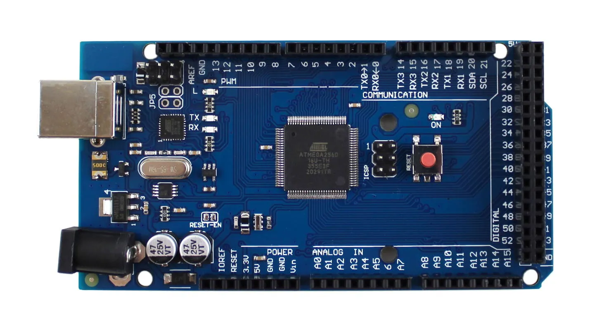
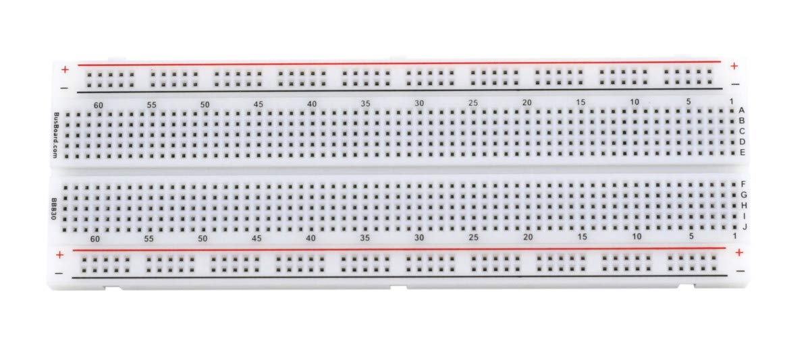
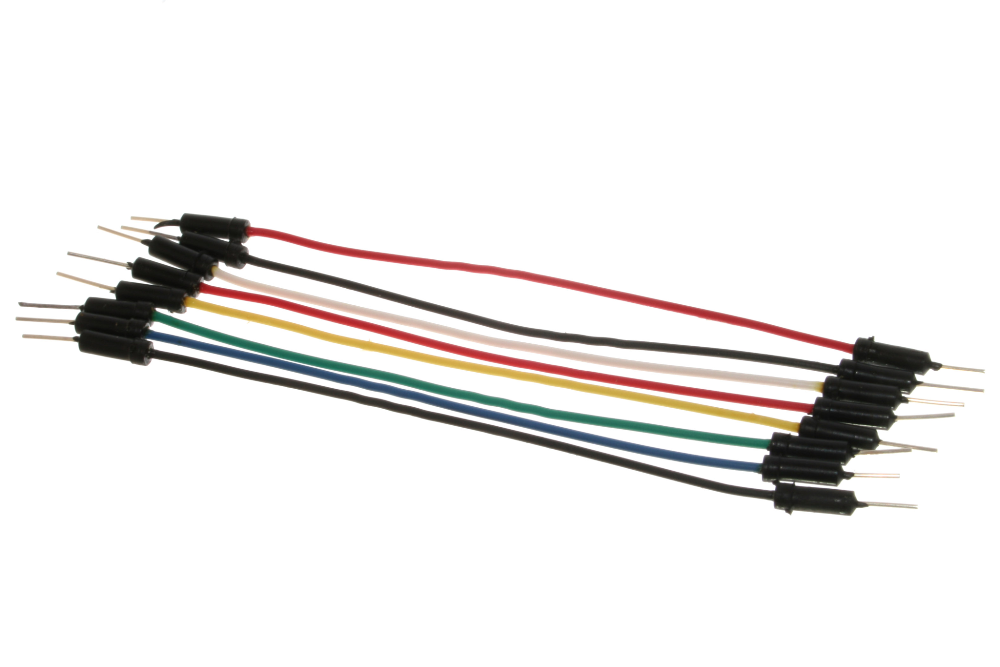
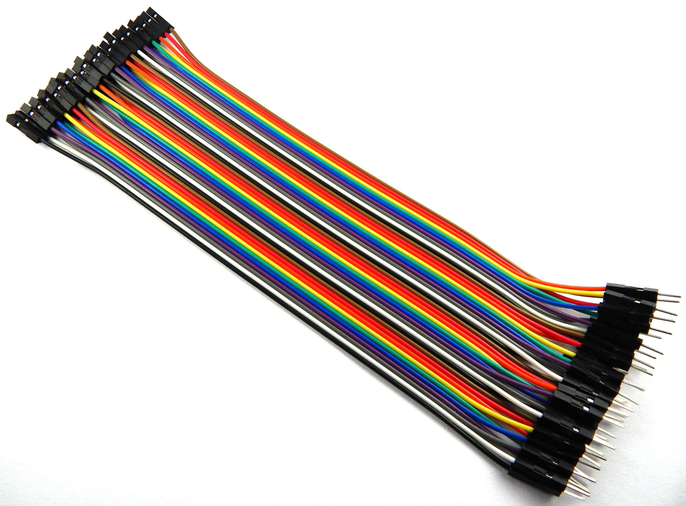
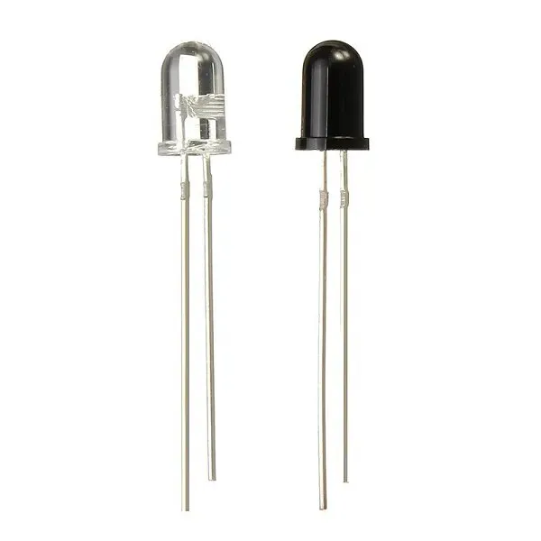
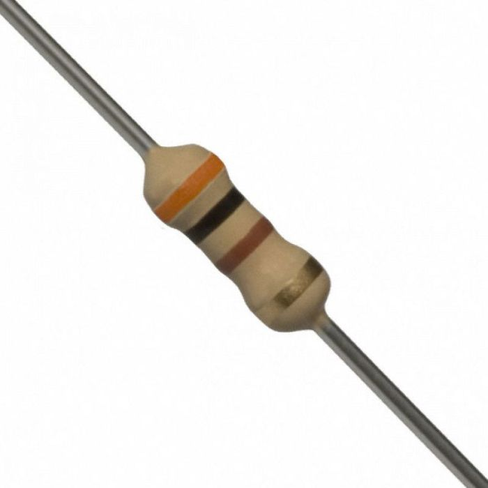
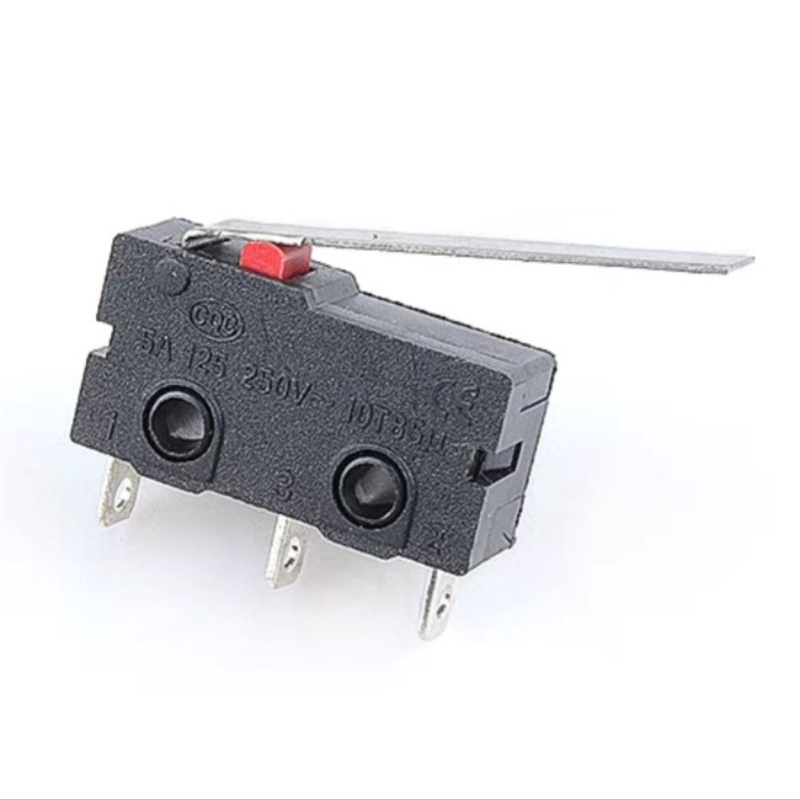
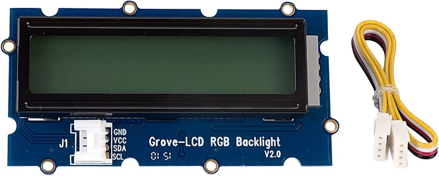
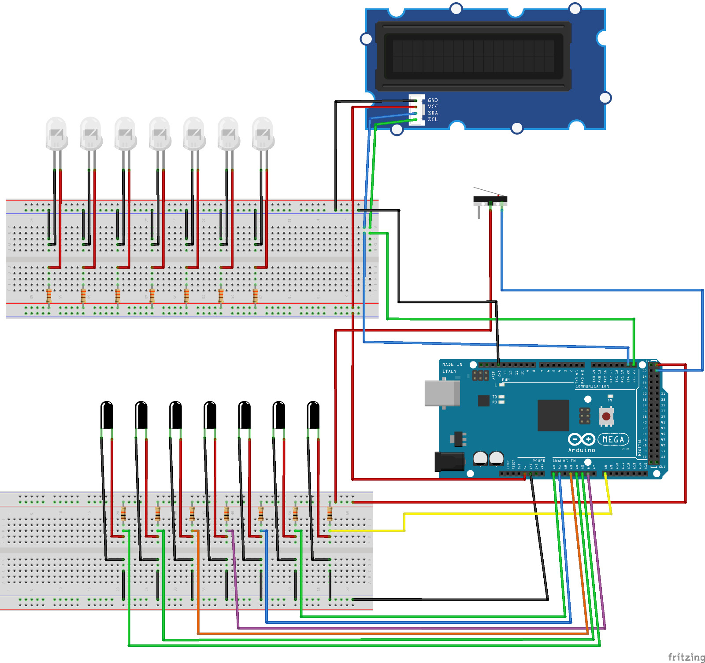

# Documentação Arduino - Gato Comedor de Moedas

DEPARTAMENTO DE CIÊNCIA DA COMPUTAÇÃO
BACHARELADO EM CIÊNCIA DA COMPUTAÇÃO

**Computação Física com Arduino**
Prof. Milene Barbosa Carvalho

**Autores:**

* Eduardo Gomes Martins
* Marina Rihs Matos Wang

---

## 1. Introdução

Este projeto consiste em criar um gato que engole moedas, com um contador que mostra o quanto de dinheiro o gato "engoliu". O gato foi modelado utilizando biscuit, o sistema para movimentação do gato e contagem das moedas foi feita com peças de arduino e uma régua impressa na impressora 3D para separar as moedas, e toda a estrutura foi construída com papelão.

A inspiração para a realização deste trabalho veio inicialmente do brinquedo "Stealing Coin Cat Bank" feito com um gatinho que puxa a a moeda para dentro da caixa sempre que a moeda é colocada em uma posição espeçífica. Por apresentar um mecanismo um pouco complexo para o arduino, nos inspiramos no brinquedo do "Cofre Devora Moedas", que, ao invés de puxar a moeda, ele simplesmente come, o que deixa o mecanismo mais simples.

---

## 2. Materiais

### 1. Arduino MEGA 2560

  

### 2. 2 x Breadboard - Full-Size

  

### 3. Jump Wires

  

### 4. Jump Wires Male to Female

  

### 5. 7 x Sensor Infra Vermelho IR Emissor + Receptor

  

### 6. 7 x Resistor 10k ohm

  

### 7. 7 x Resistor 300 ohm

  

### 8. Limit Switch

  

### 9. Grove-LCD RGB Backlight V2.0

  

---

## 3. Diagrama da Montagem (Fritzing)

  

---

## 4. Explicação Textual do Diagrama

O circuito é dividido em três partes principais:

### 1. Switch
* O switch seria utilizado futuramente para ativar o mecanismo do gato, por  agora apenas libera uma mensagem.
* Ele é conectado no ground e ao pino 23, utilizando INPUT_PULLUP para fazer a leitura.

### 2. Sensores Infra Vermelho IR Emissor + Receptor
* Os sensores são utilizados para contabilizar as moedas, dependendo qual sensor teve seu valor modificado, identificamos qual o valor da moeda.
* Cada receptor está ligado a um pino de entrada analógica: A0, A1, A3, A4, A5, A6 e A8 sendo alimentado utilizando o resistor de 10k para limitar a corrente e evitar danos.
* Cada emissor está sendo alimentado utilizando o resistor de 330Ω para limitar a corrente e evitar danos.

### 3. Display LCD RGB
* Exibe o dinheiro total que passou pelo gato.
* Comunicação I2C pelos pinos 20 (SDA) e 21 (SCL).

---

## 5. Fotos/Vídeos do Projeto

* `Link do drive:` [https://drive.google.com/drive/folders/1Pybfmc_FEBHTFAq_Zw0lyVmJ8qzrmmvx](https://drive.google.com/drive/folders/1Pybfmc_FEBHTFAq_Zw0lyVmJ8qzrmmvx)

---

## 6. Problemas encontrados no Processo de Montagem

**a) Informações sobre componentes**

* Houve uma dificuldade para encontrar uma informações sobre como os sensores IR separados funcionavam no arduino e quais resistores são utilizados.
* Assim como os sensores IR, houve dificuldade em achar informações sobre o limit switch, em específico como funcionva sua alimentação de energia.

**b) Montagem do projeto**

* A régua que separa as moedas estava travando as moedas em pontos específicos, a solução foi ajeitar os buracos da régua com um pedaço de tecido para diminuir o diâmetro.
* Outro problema foi ajustar a inclinação da régua e o jeito com que a moeda cai sobre a régua.
* A mecânica do gato não funcionou como o esperado, ajustar o servo motor para movimentar a boca e os braços acabou ficando para a próxima atualização.
* Houve dificuldade em alinhar os infravermelhos em cada posição da régua, com um pouco de paciência, funcionou.

---

## 7. Referências

* Modelo 3D da régua separadora de moedas: [https://www.printables.com/model/53280-improved-auto-coin-sorter-v75-coin-roll-classic-ve/files](https://www.printables.com/model/53280-improved-auto-coin-sorter-v75-coin-roll-classic-ve/files)
* Datasheets dos componentes (LED, resistores, buzzer, botões, Arduino Uno).
* Documentação do LCD Grove RGB: [https://wiki.seeedstudio.com/Grove-LCD_RGB_Backlight/](https://wiki.seeedstudio.com/Grove-LCD_RGB_Backlight/)
* Documentação oficial do Arduino: [https://docs.arduino.cc/](https://docs.arduino.cc/)

---
